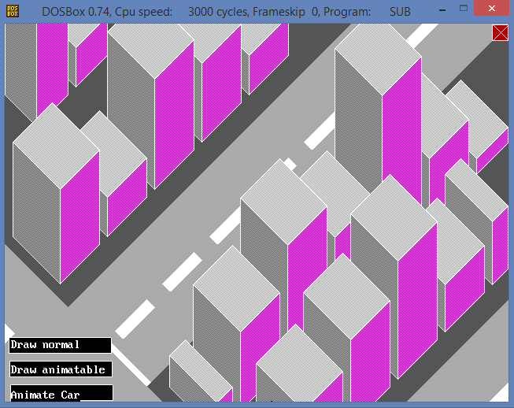
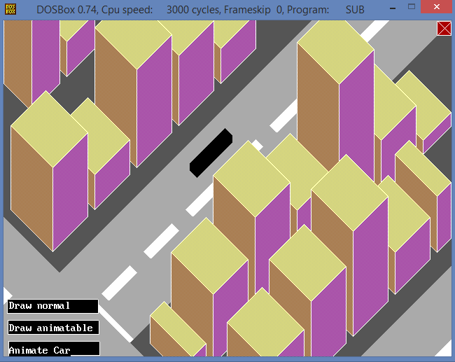
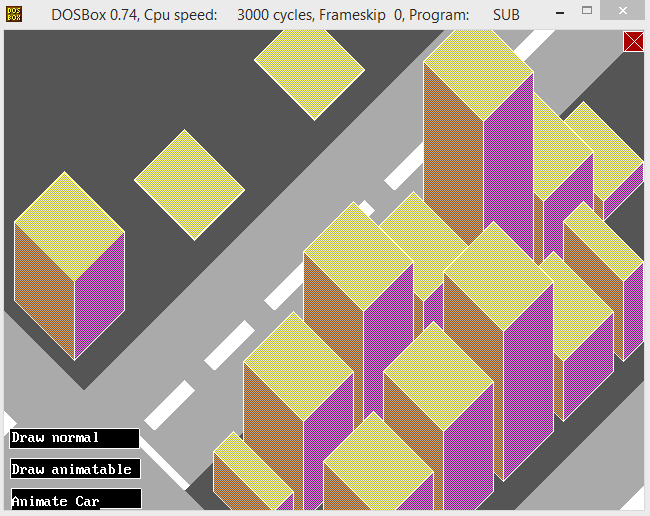

# Drawing CityScape

## About

Assembly program written in x86 assembly using TASM assembler.

## Screenshots

### Main Screen

### Car Animation

## Building Animation

## Technologies

| **Tech** | **Description** |
|----------|-----------------|
| ASM | x86 Assembly |
| TASM | Assembler used to build the project binary |
| DOSBox | Virtual Environment |

## Scripts
Script | Description
------------ | -------------
RUN.BAT | Provide asm file name as command line argument. Runs the application.
DEBUG.BAT | Provide asm file name as command line argument. Runs the debugger on the application.

## License

Apache License v2.0 © [Kyle Williamson ](https://github.com/kyledmw)