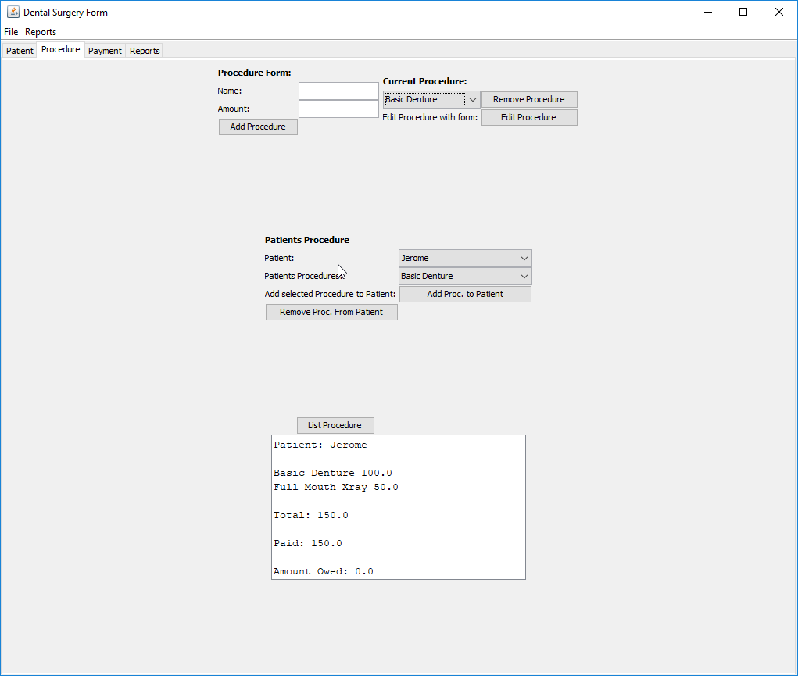

# Dental Surgery App

## About

Desktop dental surgery application implemented in Java Swing.

## Technologies

| **Tech** | **Description** |
|----------|-----------------|
| Java | Programming language used for the web-service implementation. |
| Swing | Java GUI Library used to build the application. |
| XML | Used as the datastore for the application. |

## Setup / Installation

1. Setup machine with Java & Maven
2. Install dependencies through: mvn install
3. Package application into executable jar: mvn package

## License

Apache Version 2.0 © [Kyle Williamson ](https://github.com/kyledmw)
