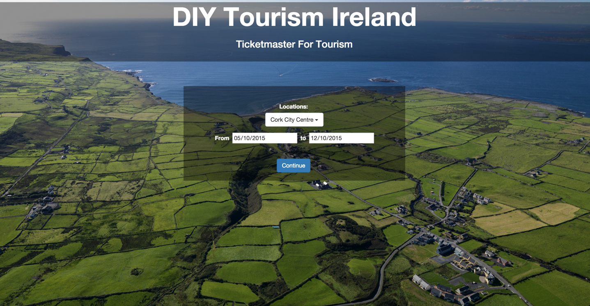

# DIY Tourism

## About

Prototype of a web application for ordering customizable all in one tourism tickets.

Technology | Description
------------ | -------------
AngularJS 1 | Popular JavaScript MVVM library
Bootstrap | CSS Framework
Python | Programming language used for web service.
Google App Engine | Deployment environment & Application Framework.

## License

Apache Version 2.0 © [Kyle Williamson ](https://github.com/kyledmw)
