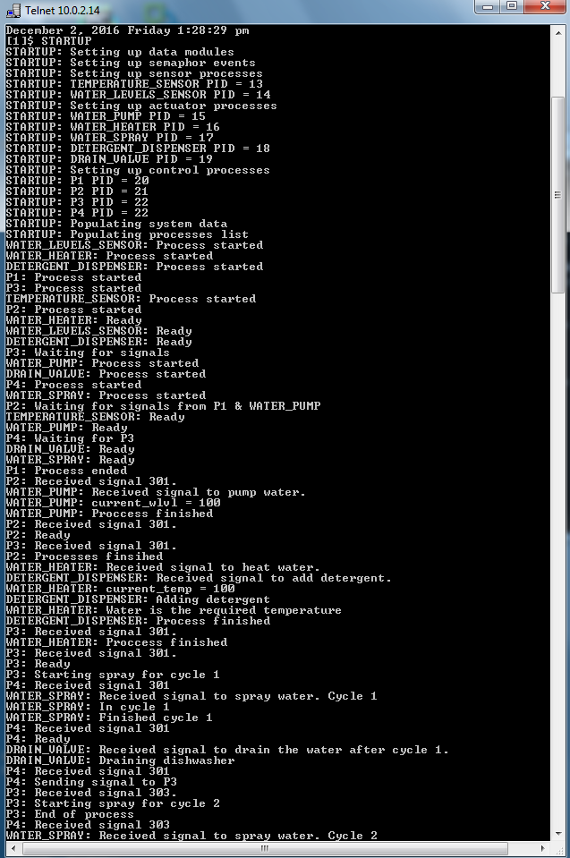
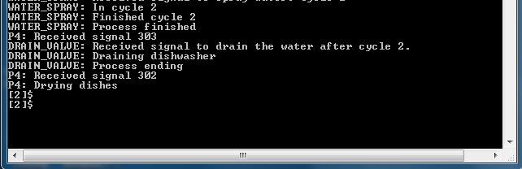

# Dishwasher

## About

Embedded real-time dishwasher program.

Different processes are executed in sequence. These control different sensors and actuators.

* Temperature
* Water Heater
* Water Levels
* Water Pump
* Water Spray
* Detergent Dispenser
* Drain Valve

## Screenshots

### Architecture

### Sequence Flow

## Command Line Output

## Technologies

| **Tech** | **Description** |
|----------|-----------------|
| C | Implementation language |

## License

Apache License v2.0 © [Kyle Williamson ](https://github.com/kyledmw)
